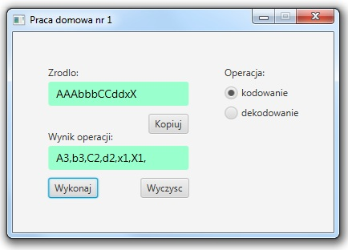

## Table of contents
* [General info](#general-info)
* [Additional info](#additional-info)
* [Screenshot](#screenshot)
* [Technologies](#technologies)
* [Author](#author)
* [Source](#source)

## General info
Homework 1 for subject INU from Warsaw University of Technology. 
Encoding and decoding application which can encode "AAAbbbCC" to "A3, b3, C2" and decode again from 2nd to 1st version.
Application uses .css styles.

## Additional info
If you want to run these application you have to install JavaFX plugin and add JavaFX libraries and additionaly before start the application - click `Run Configurations...`, choose `(x)= Arguments` and enter `--module-path "out;C:\Program Files (x86)\Java\javafx-sdk-11.0.2\lib" --add-modules=javafx.controls,javafx.fxml` to *VM Arguments* text field where **C:\Program Files (x86)\Java\javafx-sdk-11.0.2\lib** its your javafx sdk location. That's all.

## Screenshot

## Technologies
Project was created with:
* Java 12
* JavaFX

## Author
Marcin Godlewski

## Source
@FreeTymeKiyan
